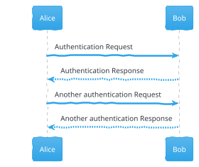
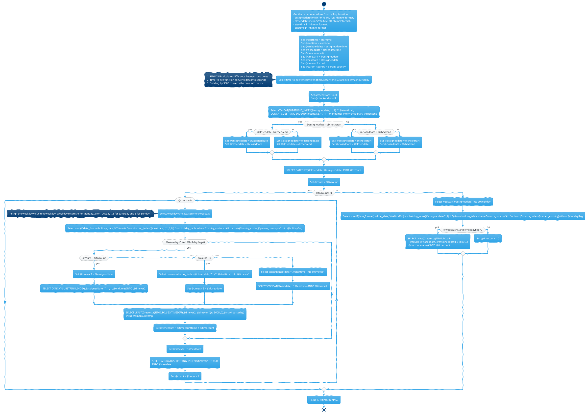
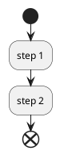
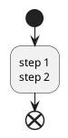

In PlantUML:

- `->`: Arrow is used for delivery message ...
- `-->`: Dotted Arrow is used for return message

@startuml
Alice -> Bob: Authentication Request
Bob --> Alice: Authentication Response

Alice -> Bob: Another authentication Request
Alice <-- Bob: Another authentication Response
@enduml

<object data="{{ site.url }}{{ site.baseurl }}/assets/images/My-mostly-vegetarian-Low-Carbs-Diet.pdf" width="1000" height="1000" type="application/pdf"></object>

