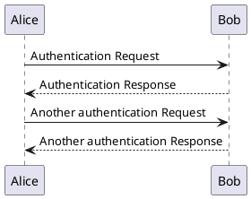

In PlantUML:

- `->`: Arrow is used for delivery message ...
- `-->`: Dotted Arrow is used for return message




```plantuml!
@startuml
skinparam handwritten true
'title Workday Time Difference Function
start
:Get the parameter values from calling function
- assigneddatetime in 'YYYY-MM-DD hh:mm' format, 
- closeddatetime in 'YYYY-MM-DD hh:mm' format,
- starttime in 'hh:mm' format,
- endtime in 'hh:mm' format;
:Set @starttime = starttime
Set @endtime = endtime
Set @assigneddate = assigneddatetime
Set @closeddate = closeddatetime
Set @timecount = 0
Set @timevar1 = @assigneddate
Set @nextdate = @assigneddate
Set @timevar2 = null;
:Select time_to_sec(timediff
(@endtime,@starttime))/3600 
into @maxhoursaday;
note left 
#TIMEDIFF calculates difference between two times
#Time_to_sec function converts data into seconds
#Dividing by 3600 converts the time into hours
end note
:Set @checkstart = null
Set @checkend = null;
:Select CONCAT(SUBSTRING_INDEX(@assigneddate, ' ', 1), ' ',@starttime),
CONCAT(SUBSTRING_INDEX(@closeddate, ' ', 1), ' ',@endtime)  into @checkstart, @checkend;

if (@assigneddate > @checkstart) then (yes)
		if (@closeddate0?) then (yes)
while (count>=0?) is (true)
:calculate weekday for nextdate
select weekday(@nextdate) into @weekday;
:Select sum(if(date_format(holiday_date,'%Y-%m-%d') = 
substring_index(@nextdate,' ',1),1,0)) from 
holiday_table where Country_codes = 'ALL' 
or instr(Country_codes,@param_country)>0 into 
@holidayflag;
note left
Set the holiday flag to 
anything other than zero
if the value in nextdate 
for this loop is a holiday
end note
if ( @weekday0 into 
@holidayflag;
note left
Set the holiday flag to 
anything other than zero
if the value in nextdate 
for this loop is a holiday
end note
if ( @weekday<5? and @holidayflag=0) then (yes)
:SELECT Least(Greatest(((TIME_TO_SEC
(TIMEDIFF(@closeddate, @assigneddate))) 
/ 3600),0),@maxhoursaday) INTO @timecount;
note left
 #TIMEDIFF calculates difference between two times
 #Time_to_sec function converts data into seconds
 #Dividing by 3600 converts the time into hours
 #if the difference was negative, GREATEST will 
 ignore result in favour of 0
 #If result is greater than max working hours, 
 LEAST will ignore result in favour of maxhoursday
end note
else (if assigned and closed over holiday / weekend, set @timecount to 0)
:Set @timecount = 0;
endif
endif
:return timecount*60;
end
@enduml
```
