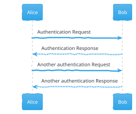
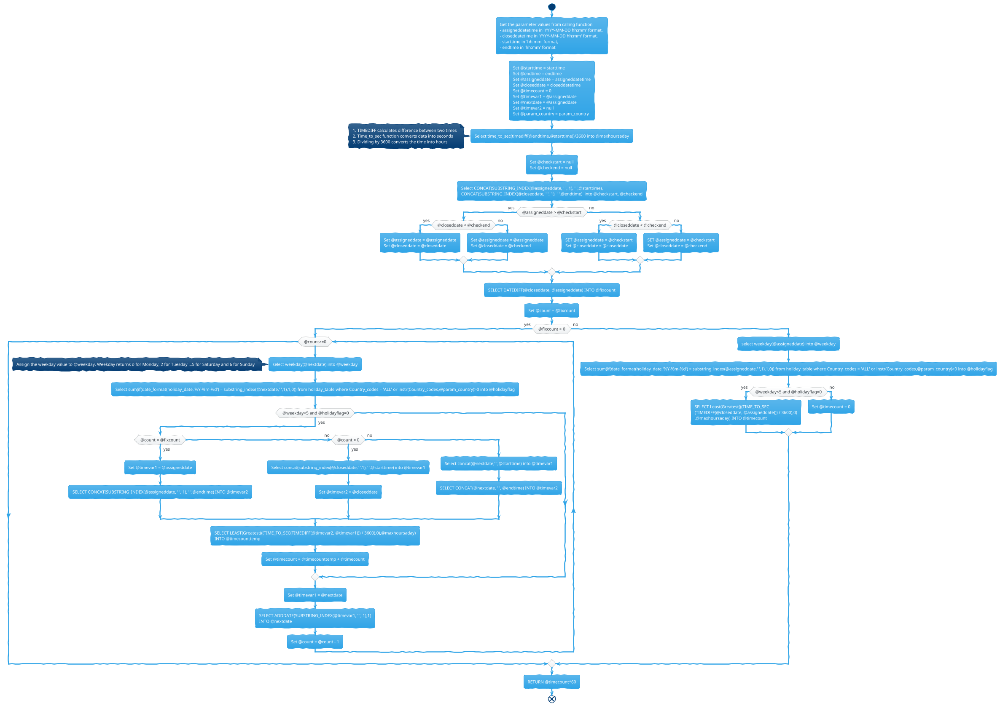
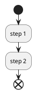
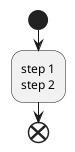

In PlantUML:

- `->`: Arrow is used for delivery message ...
- `-->`: Dotted Arrow is used for return message

@startuml
Alice -> Bob: Authentication Request
Bob --> Alice: Authentication Response

Alice -> Bob: Another authentication Request
Alice <-- Bob: Another authentication Response
@enduml

